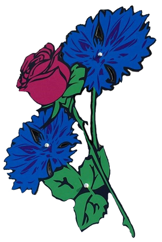

# Projet Bleuets Rose - Examen Finale  - en cours


<p style ="text-align:center;">
<a href="https://github.com/helfina/Bleuets-Rose/blob/master/README.MD">

</a>
<br>
<bloquote style="font-size: 9px;">©Tous droit réserver (sur le logo)</bloquote>
<h3 style="align:center;">Bleuets Rose</h3>
<p style ="text-align:center;">  
<a href="https://github.com/helfina/Bleuets-Rose/issues/new/choose"> Signaler un bug </a> - <a href="https://github.com/helfina/Bleuets-Rose/issues"> Demande de fonctionnalité </a>
</p>


## Badge


## A Propos du projet

    Mon projet consiste a créez un site vitrine pour une fleuriste
    qui a récement ouvert une deuxieme boutique en decembre 2019
    afin de se faire connaitre dans les environs et la rendre plus visible.
    

## Technologie utiliser

[](https://code.visualstudio.com/)

[](https://github.com/helfina/Bleuets-Rose)
[](https://www.javascript.com/try)
[](https://jquery.com/)

## Installation

>(explication de comment charger mon projet)

- cloner le projet
  
- installez composer [composer](https://getcomposer.org/doc/00-intro.md#installation-windows)
  
- dans votre terminal deplacer vous dans votre dossier
  
- coller cette ligne : `` composer init ``
  
- ajoutez dans votre fichier composer.json juste avant le require l'autoload :


```
    "autoload":{
        "psr-4":{
            "Projet\\" : "./app/"
        }
    },

```